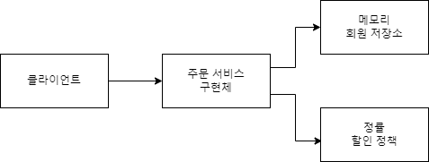

## Spring Main Point

[강의 - 스프링 핵심 원리(김영한 개발자)](https://www.inflearn.com/course/%EC%8A%A4%ED%94%84%EB%A7%81-%ED%95%B5%EC%8B%AC-%EC%9B%90%EB%A6%AC-%EA%B8%B0%EB%B3%B8%ED%8E%B8)

# 목표

- 먼저 스프링을 쓰지 않고 순수 자바를 통해 예제를 설계 및 구현해보고 스프링에 핵심 요소들을 적용해가며 스프링을 이해한다.

# 객체 지향의 5가지 원칙(SOLID)

[객체 지향의 5가지 원칙(SOLID) ](https://github.com/kyeongmin-log/spring-main-point/wiki/%EA%B0%9D%EC%B2%B4%EC%A7%80%ED%96%A5-5%EA%B0%80%EC%A7%80-%EC%9B%90%EC%B9%99)

글로 이해하기보단 실제로 사용해보면 이해하자. 

실제로 사용하고 다시 글을 보면 더 쉽게 이해할 수 있다.

# 예제

- 순수 자바로 회원, 주문, 할인 도메인을 설계 및 구현해본다.

- 여기서 말하는 도메인이란?
```
소프트웨어로 해결하고자 하는 문제의 영역을 도메인이라고 한다.
메인 도메인에서 하위 도메인으로 나뉠 수 있는데, 여기서 회원의 하위 도메인은
회원 가입, 회원 조회 등으로 볼 수 있다.

참고 : https://joont92.github.io/ddd/%EB%8F%84%EB%A9%94%EC%9D%B8-%EB%AA%A8%EB%8D%B8/
```

# 비즈니스 요구사항과 설계

## 요구사항

**회원**

- 회원을 가입하고 조회할 수 있다.
- 회원은 일반과 VIP 두 가지 등급이 있다.
- 회원 데이터는 자체 DB를 구축할 수 있고, 외부 시스템과 연동할 수 있다. (미확정)

**주문과 할인 정책**

- 회원은 상품을 주문할 수 있다.
- 회원 등급에 따라 할인 정책을 적용할 수 있다.
- 할인 정책은 모든 VIP는 1000원을 할인해주는 고정 금액 할인을 적용.(나중에 변경 될 수 있다.)
- 할인 정책은 변경 가능성이 높다. 회사의 기본 할인 정책을 아직 정하지 못했고, 오픈 직전까지 고민을 미루고 싶다. 최악의 경우 할인을 적용하지 않을 수 도 있다. (미확정)

## 설계

### 회원 도메인

**회원 도메인 협력 관계**


각 도메인의 협력 관계를 알아본다. 
요구사항을 확인해보면 미확정된 요구사항도 있기에 먼저 큰그림을 그려야한다.
미확정된 회원 저장소의 경우, 제일 간단한 메모리 회원 저장소로 구현한다.

>**#check**

기획자와 같이 보는 단계다.

>**#check**

메모리 : 휘발성이다. 서버를 종료하면 데이터는 사라진다.

DB, 외부 저장소 연동 : 데이터를 저장하기에 서버를 종료해도 데이터가 남아있다.


**회원 클래스 다이어그램**


위에서 큰그림을 그렸다면 이번엔 구현을 어떻게 할 것인지 설계하는 단계다. 이 단계에서는 인터페이스와 클래스의 관계 및 이름을 설정한다.

>**#check**

개발자들끼리 보는 단계다.

>**#check**

역활을 잘 설정해놓으면 구현을 손쉽게 확장할 수 있다.

(interface : 역활, class : 구현)

MemberRepository의 경우를 보면 역활이 잘 설정되었기에 먼저 메모리 저장소를 쓰다가도 나중에 DB 저장소로 손쉽게 변경할 수 있다.

**회원 객체 다이어그램**


- 여기서 회원 서비스는 MemberServiceImpl로 보면 된다.

실제로 서버가 동작할 때, 사용되는 객체를 의미한다. 
위에서는 '이거 이거도 쓸 수 있지.'하는 단계였다면 이번엔 '이거 쓰고 있어!' 라고 확정된 단계다. 
즉, 실제 서버에서 동작중인 서비스는 객체 다이어그램대로 흘러간다.

### 주문과 할인 정책 도메인

**주문 도메인 협력, 역할, 책임 (간략화)**

.png)

1. 주문 생성 : 클라이언트는 주문 서비스에서 주문 생성을 요청한다.
2. 회원 조회 : 할인을 위해서는 회원 등급이 필요하다. 따라서, 주문 서비스에서 회원 저장소에 있는 회원을 조회한다.
3. 할인 적용 : 주문 서비스는 회원 등급에 따라 할인 여부를 결정하기에 할인 정책에서 확인한다.
4. 주문 서비스는 할인 결과를 포함한 주문 결과를 반환한다.

회원 도메인과 동일하다. 각 도메인들끼리의 협력 관계, 역활, 책임을 큰그림으로 그려놓는다.

**주문 도메인 협력, 역할, 책임 (전체)**

.png)

역활과 구현을 분리하여 구현 객체를 조립할 수 있게 설계하였기에 회원 저장소, 할인 정책을 유연하게 변경할 수 있다.

**주문 도메인 클래스 다이어그램**


개발 단계에서 위와 같이 다이어그램을 그릴 수 있으며, 역활(interface)을 잘 만들어놓을 경우, 다음과 같은 주문 도메인 객체 다이어그램을 만들 수 있다.

**주문 도메인 객체 다이어그램(메모리, 고정할인)**

.png)

위 처럼 실제 서버에서 메모리와 고정 할인 정책을 사용하고 있다가 고객들에게 서버 점검 시간을 미리 공지하고 짧은 서버 점검 시간 안에 다음과 같이 변경할 수 있다.

.png)

변경하기 전과 비교해보면 각 도메인들의 협력 관계와 주문 서비스 구현체는 변경되지 않고 그대로 사용할 수 있다.

따라서, 미리 DB 회원 저장소 서비스와 정률 할인 정책 서비스를 만들어 놓고 기존 서비스에서 새로운 서비스로 변경할 수 있다.

즉, 기존 서비스 변경을 빠르고 안정적으로 할 수 있다.

>**#check**

고정 할인 : 미리 할인 금액을 정해놓고 할인하는 것.

정률 할인 : 상품의 가격에 따라 할인 금액이 변경되는 것.

### 서비스 변경 예제) 새로운 할인 정책 개발

```
[상황]
현재 서버는 메모리, 고정할인정책으로 구현이 완료되어있는 상태다.

어느 날 기획자가 고정 할인 정책이 아닌 정률 할인 정책으로 변경하고 싶다고 말한다.

개발자는 주문 객체 다이어그램을 다음과 같이 변경해야한다.
```



**정률 할인 정책 개발 및 테스트 결과**

_개발_

```java
...
public class RateDiscountPolicy implements DiscountPolicy{

    private int discountPersent = 10;

    @Override
    public int discount(Member member, int price) {
        if (member.getGrade() == Grade.VIP) return price * discountPersent / 100;
        else return 0;
    }
}
```

_테스트 코드_
```java
...
class RateDiscountPolicyTest {
    DiscountPolicy discountPolicy = new RateDiscountPolicy();

    @Test
    @DisplayName("VIP는 10% 할인이 적용되어야 한다")
    void vip_o(){
        // given
        Member memberVIP = new Member(1L, "memberVIP", Grade.VIP);
        // when
        int discountPrice = discountPolicy.discount(memberVIP, 20000);
        // then
        assertThat(discountPrice).isEqualTo(2000);
    }

    @Test
    @DisplayName("VIP가 아니면 할인이 적용되면 안된다")
    void vip_x(){
        // given
        Member memberBasic = new Member(2L, "memberBasic", Grade.BASIC);
        // when
        int discountPrice = discountPolicy.discount(memberBasic, 20000);
        // then
        assertThat(discountPrice).isEqualTo(0);
    }
}
```

_테스트 결과_


> 위처럼 할인 정책과 같은 상황을 테스트할 때는 VIP인 경우만 테스트하면 안된다. 반드시 VIP가 아닌 경우도 테스트해야한다.

### 새로운 할인 정책 개발 시 문제점?

> 위 처럼 개발하는 것이 좋은 방법일까?

당연히 Nope. 왜 그런지 보기 전에 구현한 코드를 실제로 사용해보아야한다.

구현한 코드를 사용하면 다음과 같다.

```java
...
 public class OrderServiceImpl implements OrderService{

    private final MemberRepository memberRepository = new MemoryMemberRepository();
    private final DiscountPolicy discountPolicy = new RateDiscountPolicy();
    //private final DiscountPolicy discountPolicy = new FixDiscountPolicy();
...
```

FixDiscountPolicy() => RateDiscountPolicy() 으로 바꿔주면 코드는 문제없이 돌아간다. 

또한, 실제 내가 생각한대로 서비스가 돌아간다.

인터페이스와 구현체를 잘 구분하여 객체 지향 프로그래밍의 핵심인 다형성도 적절히 활용한 거 같다.

그럼 무엇이 문제일까?

문제는 할인 정책을 변경하려면 OrderServiceImpl 을 수정해야한다는 것과 
인터페이스와 구현체를 적절히 구분하여 사용한 거 같지만 실제론 그렇지 않다는 점에 있다.

먼저 개발하려고한 생각한 주문 도메인 클래스 다이어그램을 먼저 보자.


클래스 다이어그램을 보면 알 수 있듯이 
OrderServiceImpl 은 DiscountPolicy 라는 인터페이스만 의존하여 개발되어야 하는데 

현재는 다음과 같이 의존하여 개발하고 있다.


위 그림과 다른점이 보이는가?

내가 만든 OrderServiceImpl 은 DiscountPolicy 라는 인터페이스만 의존한 것이 아닌 FixDiscountPolicy, RateDiscountPolicy 라는 구현체에도 의존한 것을 볼 수 있으며, Fix => Rate 로 바꾸기위해 OrderServiceImpl 에서 코드를 변경하였다.

이는 객체 지향의 5가지 원칙(SOLID) 중 OCP, DIP 규칙에 어긋난다고 볼 수 있다.

> 규칙이 기억이 안날 수 있다. [객체 지향의 5가지 원칙(SOLID) ](https://github.com/kyeongmin-log/spring-main-point/wiki/%EA%B0%9D%EC%B2%B4%EC%A7%80%ED%96%A5-5%EA%B0%80%EC%A7%80-%EC%9B%90%EC%B9%99) 을 읽고 오자.

### 그럼 문제를 어떻게 해결할 수 있을까?

문제는 OrderServiceImpl 에서 DiscountPolicy 의 구현체를 변경하면서 시작된다.

그럼 해결 방법은 간단하다! 구현체를 없애면 된다.

다음과 같이 코드를 짤 수 있다.

```java
...
 public class OrderServiceImpl implements OrderService{

    private final MemberRepository memberRepository = new MemoryMemberRepository();
    private final DiscountPolicy discountPolicy;
...
```

This is very simple!

...But 이렇게 짜면 코드는 당연히 에러를 발생시킨다.

Why? 구현체가 없으니 discountPolicy 를 호출하면 Null 값 밖에 없으므로 NullPointException 이 발생한다.

그럼 다시 전으로 돌아가야할까? Nope. 우리는 다음 단계로 가기 위해 AppConfing 클래스를 사용할거다.

### AppConfig Class?

어떻게 구현체없이 인터페이스를 사용할 수 있을까?

다음과 같이 생각해보자.

> 미리 인터페이스에 구현체를 넣어놓고 가져와서 사용하자!

이것을 가능하게 하기 위해 AppConfig 이라는 클래스를 사용할 것이다.

AppConfig 클래스는 다음과 같이 작성할 수 있다. (MemberRepository도 같이 변경하였다.)

```java
...
public class AppConfig {

    public MemberService memberService(){
        return new MemberServiceImpl(new MemoryMemberRepository());
    }

    public OrderService orderService(){
        return new OrderServiceImpl(new MemoryMemberRepository(), new FixDiscountPolicy());
    }
}
```

코드를 보면 인터페이스에 구현체를 미리 넣어놓고 구현체(OrderServiceImpl) 안에 있는 인터페이스에 구현체를 넣기 위해 생성자를 사용하고 있다. 

AppConfig 을 사용하기 위해 OrderServiceImpl를 다음과 같이 변경해보자.

```java
...
public class OrderServiceImpl implements OrderService{

    private final MemberRepository memberRepository;
    private final DiscountPolicy discountPolicy;

    public OrderServiceImpl(MemberRepository memberRepository, DiscountPolicy discountPolicy) {
        this.memberRepository = memberRepository;
        this.discountPolicy = discountPolicy;
    }
...
```

짠! 

생성자를 이용하여 어딘가에서 OrderService 를 이용하면 OrderService 의 구현체인 OrderServiceImpl 에 생성자를 부르게되고 생성자를 통해 DiscountPolicy 의 구현체가 FixDiscountPolicy 로 설정된다! (Amazing!)

> 이처럼 생성자를 통해 의존 관계를 설정(주입)하는 것을 생성자 주입이라고 한다.

이제 FixDiscountPolicy 를 사용하다가 RateDiscountPolicy 로 변경하여도 OrderServiceImpl 클래스는 아무런 변경이 필요없다. 단지, AppConfig 에서 구현체만 변경해주면 된다.

즉, OrderServiceImpl 는 실행하는 역활만 맡게 되고 객체를 생성하거나 연결하는 역활은 AppConfig 이 맡게 된다. 관심사가 명확하게 분리된 것을 볼 수 있다.

AppConfig 을 이용하여 간단하게 사용해보면 다음과 같이 사용할 수 있다.

```java
...
public class OrderApp {
    public static void main(String[] args) {
        /** 이전에 사용한 방식
        MemberService memberService = new MemberServiceImpl();
        OrderService orderService = new OrderServiceImpl();
        */
        // AppConfig 을 사용한 방식
        AppConfig appConfig = new AppConfig();
        MemberService memberService = appConfig.memberService();
        OrderService orderService = appConfig.orderService();

        Member member = new Member(1L, "memberA", Grade.VIP);
        memberService.join(member);

        Member findMember = memberService.findMember(member.getId());
        Order order = orderService.createOrder(findMember.getId(),"itemA", 10000);

        System.out.println("order = " + order);
        System.out.println("order.calculatePrice() = " + order.calculatePrice());
    }
}
```

이제 직접 구현체를 넣어서 사용하는 것이 아니라 AppConfig에 있는 orderService 를 사용하게 되면 구현체(OrderServiceImpl)가 생성되고 구현체의 생성자를 통해 구현체에서 사용되고 있는 인터페이스에 구현체(MemoryMemberRepository, FixDiscountPolicy)가 설정되어 사용되는 것을 확인할 수 있다.

### 다시 새로운 할인 정책 적용

다시 RateDiscountPolicy 를 적용해보자. 

이제 OrderServiceImpl 에서 코드를 변경할 필요가 없다.

AppConfig 에서 다음과 같이 변경하면 된다.

> 참고 : AppConfig 코드를 Refactoring 하였다. 자세한 사항은 [여기](https://github.com/kyeongmin-log/spring-main-point/commit/46728c16856b65786fe7f6563cb40ffb4a7ecf6b) 를 참고하자.

```java
public class AppConfig {
...
    public DiscountPolicy discountPolicy(){
//        return new FixDiscountPolicy();
        return new RateDiscountPolicy();
    }
}
```

THIS IS VERY SIMPLE!

OrderServiceImpl 코드는 하나도 안건드리면서 할인 정책을 변경하였다.

> Q. AppConfig 을 변경하였는데요?

A. 개발자는 극한의 상황을 생각해야한다. 만약 orderService 를 사용하는 클래스가 1억개 있다고 생각해보자. 1억개를 AppConfig을 사용하지 않고 각 구현체에서 직접 할당하여 사용하였다.

약 1년간 고정 할인으로 서비스하다가 어느 날 회의 시간에 기획자가 말한다. '저희 이제 고정 할인이 아니라 정률 할인으로 갈거에요.' AppConfig 을 사용하지 않은 개발자는 생각한다. 'What the...F...F...F.'. RateDiscountPolicy 를 만들고 1초에 한 개의 구현체를 바꾼다고 해도 1억 초라는 시간이 걸린다. 야근 확정이다.

AppConfig 을 사용한 개발자는 바로 RateDiscountPolicy 를 짜서 1초 만에 변경한다. 1억 개의 구현체가 한 번에 바뀌고 칼퇴근을 한다.

극단적인 예였지만 실무에서는 복잡한 경우의 수로 생각보다 이런 일이 종종 생긴다. 

따라서, 실행하는 역활과 객체를 생성하고 할당하는 역활를 구분하는 것은 매우 중요하다. 